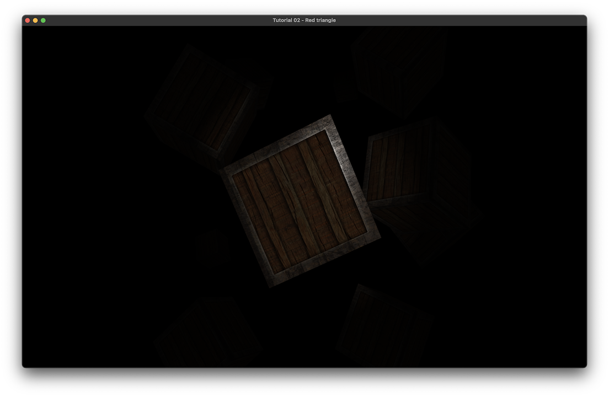

# Sandbox

Данный проект &#x2013; это мои наработки по ходу чтения книги learnopengl.com.

Уже есть:

-   3д сцена с самописными model/view/projection матрицами (для улучшения их понимания я реализовал самостоятельно)
-   Передвижение по сцена с сменой направления взгляда (на WASD и стрелочки)
-   Базовое освецение

# Computer Graphics Concept

## Мои догадки про причину создания GPU

1.  Изначально компьютер состоял лишь из одного процессора &#x2013; CPU.
2.  Но графика, с течением времени все усложнялась и требовал больше вычислительных мощностей. Также из-за архитектуры CPU, он не совсем подходил для графических вычислений, где нужно выполнять огромное количество одинаковых вычислений.
3.  Чтобы разрешить эту проблему, в компьютер добавили еще один процессор &#x2013; GPU.
4.  Компьютером по прежнему рулил CPU, но графические вычисления он передавал на GPU.
5.  GPU был создан для графических вычислений и больше подходил для этого, чем CPU:
    -   был заточен под множество параллельных вычислений
    -   был заточен под множество коротких операций
6.  Но основным решением было то, что теперь графические вычилсения выполняются не на CPU.

## Из чего состоит GPU

### Графический процессор

### Видеопамять

Здесь стоит отметить, что видеопамять должна обладать очень высокой скоростью. 

Например при разрешении 1024x768, с True Color (24 бита на пиксель) один кадр весит 2.25 Мб. С учетом частоты обновления в 75 гц (75 fps?) пропускная способность в секунду должны быть 170 Мб/с.

В видеопамяти хранится:

-   само изображение
-   данные текстур
-   шейдеры
-   вершины
-   значения Z компоненты

1.  [framebuffer](https://en.wikipedia.org/wiki/Framebuffer)

    Это участок памяти, который находится или в памяти самой GPU (video memory) или в RAM, и содержит в себе информацию о каждом отображаемом пикселе экрана.

### Видеоконтроллер

Дает команды дисплею и получает команды от CPU

### Цифро-Аналоговый преобразователь

Преобразователь, который превращает цифровое изображение (массив чисел) в его аналоговую версию (череда электрических импульсов).

С распространением ЖК мониторов нужна в этом преобразоветеле отпала, так как данные мониторы работают с цифровыми данными самостоятельно.

### Видео-ПЗУ

Постоянная память видеокарты, которая содержит в себе BIOS видеокарты и другую служебную информацию. С этой памятью работает только CPU. Видеоконтроллер к ней не обращается.

### Коннектор

### Система охлаждения

# OpenGL

## Что такое OpenGL

OpenGL это программный интерфейс к GPU.

OpenGL это спецификация библиотеки, которую должны предоставить разработчики видеокарты, которая соответствует данной спецификации.

> при обновлении драйверов видеокарты часто и обновляется версия OpenGL.

## Graphics Pipeline

### Vertex shader

Данный шейдер принимает в себя вертекс (из массива вертексов) 
И должен выдать координату

1.  Что такое Vertex?

    Vertex это данные для вершины. Например вертексом может быть координаты и цвет вершины.

### Shape assembly

На шаге конфигурации OpenGL был указан тип примитивов, который будет использоваться при отрисовке (просто точки, треугольник, линия).

Данный шаг должен сформировать из координатов от Vertex Shader-а данные примитивы.

### TODO Geometry shader

Принимает в себя примитивы от прошлого шага и способен на базе этих примитивов добавить новые. (непонятно, раз это шейдер, то хорошо бы посмотреть его возможный код)

### Rasterization

Превращает примитивы в пиксели

### Fragment shader

1.  Что такое Fragment?

    Данные, необходимые для рендеринга пикселя.
    
    Определяет цвет каждого пикселя

### Alpha test and blanding stage

Определяет что нужно отрисовывать, а что не нужно (может быть скрыто за другими объектами, или прозрачно)

Разруливает прозрачность

## Coordinate systems

### TBR (To be read)

[x[] advanced article about projection matrices](http://www.songho.ca/opengl/gl_projectionmatrix.html)

# todos

## DONE recursive triangles

-   done, but can it be done using only linear transformations? in triangle proc.
-   color rainbow for each triangle (need separate location).

## DONE rotated cube

## dvd placeholder

## draw a spinning donut with ogl

## STARTED physical engine in open gl

-   can throw thing
-   it can bounce

